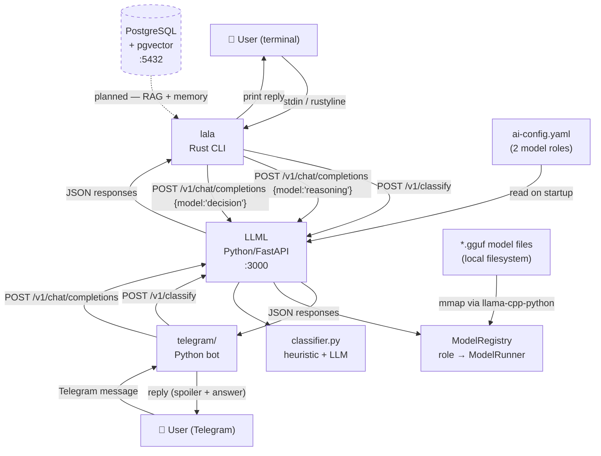
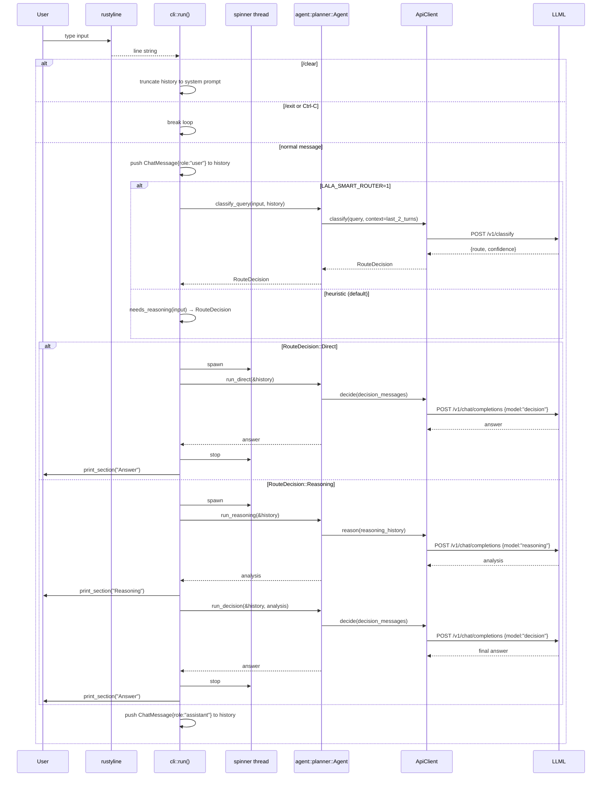
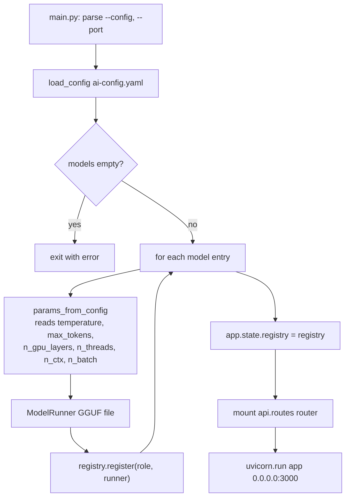
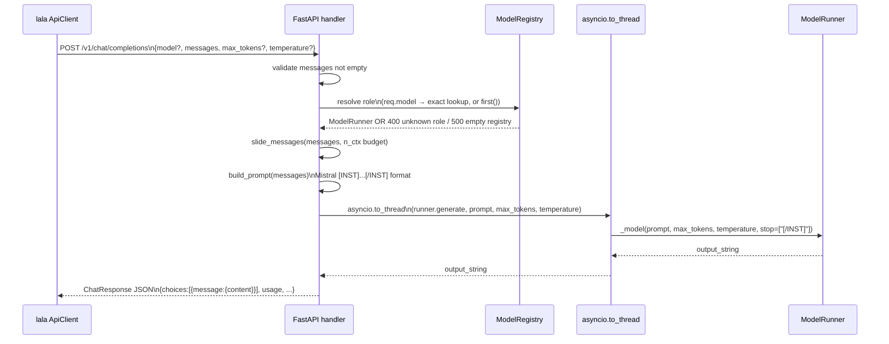
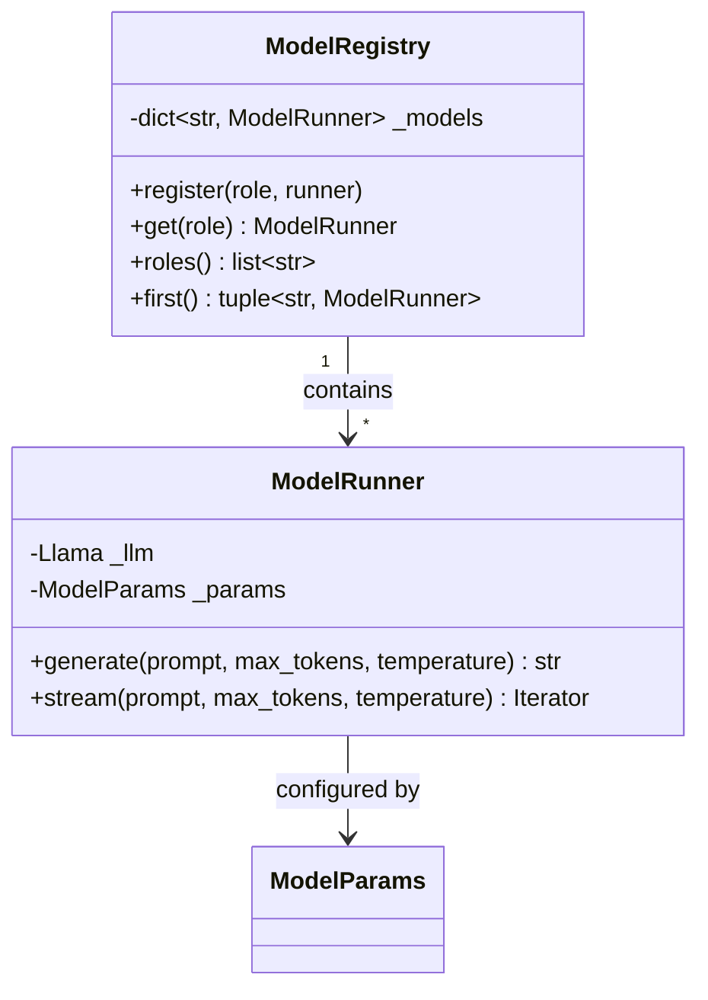
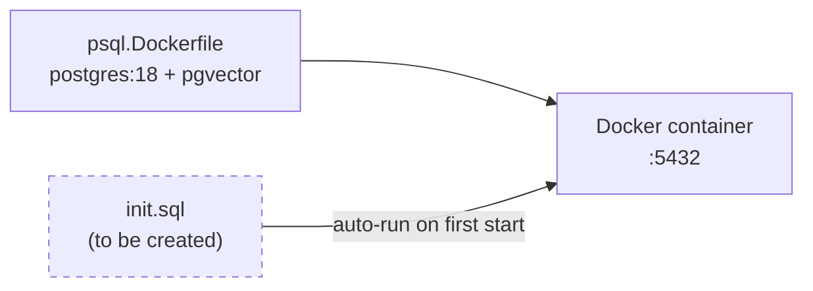
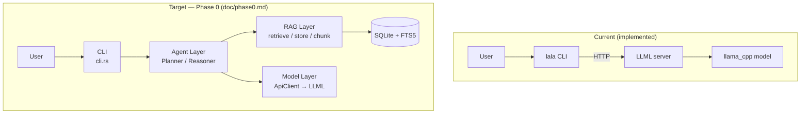

# lala.ai — System Architecture

> **Current state:** Phase 0 in progress — three-component system (`lala` Rust CLI + `LLML` Python inference server + `telegram` Python bot) communicating over HTTP. LLML serves an OpenAI-compatible API with two model roles (`reasoning` / `decision`) and a query-classification endpoint (`/v1/classify`). A smart query router in each client skips the reasoning step for simple or conversational queries. PostgreSQL/pgvector is provisioned but not yet wired into the live request loop.

---

## 1. Repository Layout

```
lala.ai/
├── ai-config.yaml          # Shared model configuration (read by LLML at startup)
├── LLML.Dockerfile         # LLML inference server Docker image (CPU; GPU-ready)
├── psql.Dockerfile         # PostgreSQL 18 + pgvector image
├── lala/                   # Rust CLI client
│   ├── Cargo.toml
│   └── src/
│       ├── main.rs         # Entry point — resolves API URL + LALA_SMART_ROUTER flag
│       ├── cli.rs          # REPL loop, spinner, conversation history
│       └── agent/
│           ├── mod.rs
│           ├── model.rs    # ApiClient — HTTP wrapper (chat, classify); RouteDecision enum
│           └── planner.rs  # Agent — query router, reasoning→decision pipeline
├── LLML/                   # Python inference server (FastAPI + llama-cpp-python)
│   ├── main.py             # Entry point — loads config, starts uvicorn on :3000
│   ├── config.py           # Deserializes ai-config.yaml → ModelParams
│   ├── requirements.txt
│   ├── model/
│   │   ├── runner.py       # ModelRunner — generate() + stream() via asyncio.to_thread
│   │   └── registry.py     # ModelRegistry: role (str) → ModelRunner
│   └── api/
│       ├── routes.py       # Router: /v1/chat/completions, /v1/models, /v1/classify
│       └── classifier.py   # Shared heuristic + CLASSIFIER_SYSTEM prompt constant
└── telegram/               # Telegram bot client
    ├── app.py              # Entry point — wires handlers, starts long-polling
    ├── config.py           # Config from environment variables (incl. SMART_ROUTER)
    ├── requirements.txt
    ├── agent/
│   ├── client.py       # LLMLClient — reason(), decide(), classify()
│   └── conversation.py # Per-user rolling conversation history (thread-safe)
    └── bot/
        ├── handlers.py     # Pipeline: classify → direct | reason→decide; spoiler formatting
        └── middleware.py   # Auth guard
```

---

## 2. High-Level System Diagram



Solid lines = live today. Dashed = provisioned, not yet in the request loop.

---

## 3. Binary Entry Points

### 3.1 `lala` — CLI client

**Crate:** `lala/`  
**Entry:** `lala/src/main.rs`

```
cargo run [-- <LLML_API_URL>]
```

URL resolution order:
1. First positional CLI argument
2. `LLML_API_URL` environment variable
3. Fallback: `http://localhost:3000`

`main()` also reads `LALA_SMART_ROUTER` — if set to `"1"`, the LLM-based classifier is used instead of the local heuristic. Both values are passed to `cli::run(&api_url, smart_router)`.

---

### 3.2 `LLML` — inference server

**Location:** `LLML/`  
**Entry:** `LLML/main.py`

```
python main.py [--config PATH] [--port PORT]
# reads ../ai-config.yaml by default, binds 0.0.0.0:3000
```

Startup sequence (see §5 for detail):
1. Parse CLI args (`--config`, `--port`)
2. `load_config("../ai-config.yaml")`
3. For each model in config → `ModelRunner(path, params)` → register in `ModelRegistry`
4. Build FastAPI app with registry in `app.state`, mount API router
5. `uvicorn.run(app, host="0.0.0.0", port=3000)`

---

## 4. lala — CLI Client Flow



**Conversation history** is a `Vec<ChatMessage>` that permanently holds the system prompt at index 0:

```
index 0   { role: "system",    content: SYSTEM_PROMPT }
index 1   { role: "user",      content: "..." }
index 2   { role: "assistant", content: "..." }
...
```

The entire vector is sent on every request so the model maintains multi-turn context. `/clear` truncates back to `len == 1`.

### ApiClient — model role selection and classification

`ApiClient` in `lala/src/agent/model.rs` exposes four call paths:

| Method | Endpoint | Notes |
|--------|----------|-------|
| `chat(&msgs, max_tokens, None)` | `POST /v1/chat/completions` | Server picks first registered model |
| `reason(&msgs, max_tokens)` | `POST /v1/chat/completions` | `model: "reasoning"`, temp 0.7 |
| `decide(&msgs, max_tokens)` | `POST /v1/chat/completions` | `model: "decision"`, temp 0.3 |
| `classify(query, context)` | `POST /v1/classify` | Returns `RouteDecision::{Direct,Reasoning}` |

`planner.rs` exposes `Agent::classify_query(input, history)` which wraps `client.classify()` with a local `needs_reasoning()` heuristic fallback. `cli.rs` calls the method when `smart_router=true`, otherwise resolves directly via `needs_reasoning()`.

---

## 5. LLML — Inference Server Flow

### 5.1 Multi-Model Configuration (`ai-config.yaml`)

LLML loads **all** models declared in `ai-config.yaml` at startup and stores them in a `ModelRegistry` keyed by `role`. Two roles are defined by default:

| Role | Type | Temperature | `n_ctx` | Purpose |
|------|------|-------------|---------|---------|
| `reasoning` | Reasoning | 0.7 | 2048 | Deep analysis, multi-step thinking |
| `decision` | Decision | 0.3 | 512 | Short, deterministic action selection |

The `role` field in each model entry is the API-facing key. Both roles currently load the same GGUF file — swap `modelPath` independently to use different checkpoints.

### 5.2 Startup



### 5.3 Request: POST /v1/chat/completions



### 5.3 Request: GET /v1/models

Returns all registered role names (e.g. `"reasoning"`, `"decision"`) in OpenAI list format. No inference involved.

---

## 6. Agent — Two-Step Planner Loop

`lala/src/agent/planner.rs` implements the `Agent` struct that drives every user turn.

### How it works

```
user query
    │
    ▼
┌─────────────────────────────────────────────────────────┐
│  Step 1 — Reason  (model: "reasoning", temp: 0.7)       │
│  Input:  full conversation history                      │
│          + REASONING_SYSTEM prompt                      │
│  Output: internal analysis string  (never shown)        │
└────────────────────────────┬────────────────────────────┘
                             │ analysis
                             ▼
┌─────────────────────────────────────────────────────────┐
│  Step 2 — Decide  (model: "decision", temp: 0.3)        │
│  Input:  DECISION_SYSTEM prompt                         │
│          + analysis appended as hidden [system] message │
│          + last user message                            │
│  Output: final answer shown to user                     │
└─────────────────────────────────────────────────────────┘
```

### Why two steps?

| Concern | Reasoning model | Decision model |
|---------|----------------|----------------|
| Temperature | 0.7 — creative, exploratory | 0.3 — deterministic, concise |
| Context window | 2048 — can hold full history | 512 — tight, focused on final answer |
| Job | Think through the problem | Turn analysis into a clean reply |
| Visible to user | No | Yes |

### Message arrays

**Step 1 input** — full history with the REPL system prompt swapped for `REASONING_SYSTEM`:
```
[{role:"system", content:REASONING_SYSTEM}, {role:"user",...}, {role:"assistant",...}, ...]
```

**Step 2 input** — condensed array (keeps the decision model within its 512-token window):
```
[{role:"system", content:DECISION_SYSTEM},
 {role:"system", content:"[Internal analysis — do not quote this]\n{analysis}"},
 {role:"user",   content:"{last_user_message}"}]
```

### `Agent` API

```rust
pub struct Agent<'a> { client: &'a ApiClient }
impl<'a> Agent<'a> {
    pub fn new(client: &'a ApiClient) -> Self
    pub fn classify_query(&self, input: &str, history: &[ChatMessage]) -> RouteDecision
    pub fn run_direct(&self, history: &[ChatMessage]) -> anyhow::Result<String>
    pub fn run_reasoning(&self, history: &[ChatMessage]) -> anyhow::Result<String>
    pub fn run_decision(&self, history: &[ChatMessage], analysis: &str) -> anyhow::Result<String>
    fn replace_system(history: &[ChatMessage], new_system: &str) -> Vec<ChatMessage>
}
```

`classify_query` calls `client.classify()` and falls back to `needs_reasoning()` on error. `cli.rs` branches on the returned `RouteDecision` to pick the direct or reasoning path.

The reasoning output (`analysis`) is displayed to the user in the CLI under a `▷ Reasoning` section with yellow ANSI colouring. In the Telegram bot it is wrapped in a `<tg-spoiler>` so users can tap to reveal it.

---

## 7. Configuration — `ai-config.yaml`

Parsed by `LLML/config.py` (`load_config()`) into a `list[ModelParams]` dataclass on startup. Each model defines a role key, GGUF path, and inference parameters.

```mermaid
classDiagram
    class ModelParams {
        +str role
        +str model_path
        +float temperature
        +int max_tokens
        +int n_gpu_layers
        +int n_threads
        +int n_ctx
        +int n_batch
    }
    class AiConfig {
        +int version
        +list~ModelParams~ models
    }
    AiConfig --> ModelParams
    note for ModelParams {
        +str name
        +str description
        +str role
    }
```

**Registered models (current `ai-config.yaml`):**

| Role | Model name | Temperature | max_tokens | n_ctx |
|------|-----------|-------------|------------|-------|
| `reasoning` | mistral-reasoning | 0.7 | 512 | 2048 |
| `decision` | mistral-decision | 0.3 | 256 | 512 |

Both point to the same GGUF file (`mistral-7b-v0.1.Q4_K_M.gguf`). Different `ModelRunner` instances are loaded with different params.

---

## 8. Model Layer Internals



**Thread safety:** `ModelRunner` wraps `llama-cpp-python`'s `Llama` object. Each HTTP request runs inference via `asyncio.to_thread()` so the async event loop is never blocked. There is no shared mutable session state across concurrent requests.

---

## 9. Prompt Format

`build_prompt()` in `LLML/api/routes.py` converts the OpenAI `messages` array into the Mistral/Llama instruction format:

```
<s>[INST] {system_prompt}

{first_user_message} [/INST] {assistant_reply} </s>[INST] {next_user} [/INST]...
```

The output stream is cut early when a `[/INST]` marker appears in generated tokens, preventing prompt leakage.

---

## 10. HTTP API Reference

Both endpoints live on `LLML` at port `3000`.

### POST `/v1/chat/completions`

**Request:**
```json
{
  "model": "reasoning",
  "messages": [
    { "role": "system",    "content": "You are a helpful assistant." },
    { "role": "user",      "content": "What is Rust?" }
  ],
  "max_tokens": 200
}
```

| Field | Required | Notes |
|-------|----------|-------|
| `messages` | yes | Non-empty array. First element may be `system`. |
| `model` | no | Role key from registry. Omit to use first registered model. |
| `max_tokens` | no | Overrides the config default for this request. |
| `temperature` | no | Overrides the model config default for this request (0.0–2.0). |

**Response:** OpenAI-compatible `ChatResponse` with `choices[0].message.content`.

#### curl examples

**1. Default model (server picks first registered — `reasoning`):**
```sh
curl -s http://localhost:3000/v1/chat/completions \
  -H "Content-Type: application/json" \
  -d '{
    "messages": [
      { "role": "user", "content": "What is Rust?" }
    ]
  }' | jq '.choices[0].message.content'
```

**2. Explicit `reasoning` model with a system prompt and multi-turn history:**
```sh
curl -s http://localhost:3000/v1/chat/completions \
  -H "Content-Type: application/json" \
  -d '{
    "model": "reasoning",
    "messages": [
      { "role": "system",    "content": "You are a helpful AI assistant named lala." },
      { "role": "user",      "content": "Explain ownership in Rust." }
    ],
    "max_tokens": 512
  }' | jq '.choices[0].message.content'
```

**3. `decision` model — short, deterministic output:**
```sh
curl -s http://localhost:3000/v1/chat/completions \
  -H "Content-Type: application/json" \
  -d '{
    "model": "decision",
    "messages": [
      { "role": "user", "content": "Should I use Vec or LinkedList for a stack in Rust? Answer in one sentence." }
    ],
    "max_tokens": 64
  }' | jq '.choices[0].message.content'
```

**4. Override temperature at request time:**
```sh
curl -s http://localhost:3000/v1/chat/completions \
  -H "Content-Type: application/json" \
  -d '{
    "model": "reasoning",
    "messages": [
      { "role": "user", "content": "Write a creative haiku about memory safety." }
    ],
    "max_tokens": 100,
    "temperature": 1.2
  }' | jq '.choices[0].message.content'
```

**5. Multi-turn conversation (pass full history on each request):**
```sh
curl -s http://localhost:3000/v1/chat/completions \
  -H "Content-Type: application/json" \
  -d '{
    "model": "reasoning",
    "messages": [
      { "role": "system",    "content": "You are lala, a concise technical assistant." },
      { "role": "user",      "content": "What is a borrow checker?" },
      { "role": "assistant", "content": "The borrow checker is a Rust compiler component that enforces memory safety rules at compile time." },
      { "role": "user",      "content": "How does it relate to lifetimes?" }
    ],
    "max_tokens": 256
  }' | jq '.choices[0].message.content'
```

### POST `/v1/classify`

Classifies a query as requiring reasoning or a direct answer. Used by `lala` CLI (when `LALA_SMART_ROUTER=1`) and by the Telegram bot (when `SMART_ROUTER=1`).

**Request:**
```json
{
  "query": "what's the weather like today?",
  "context": [
    { "role": "user",      "content": "hi" },
    { "role": "assistant", "content": "Hello! How can I help?" }
  ],
  "model": "reasoning"
}
```

| Field | Required | Notes |
|-------|----------|-------|
| `query` | yes | The raw user message to classify |
| `context` | no | Last 1–2 conversation turns for context |
| `model` | no | Which model to use for LLM classification; defaults to `"reasoning"` |

**Response:**
```json
{ "route": "direct", "confidence": "heuristic" }
```

| Field | Values | Notes |
|-------|--------|-------|
| `route` | `"direct"` \| `"reasoning"` | Destination path |
| `confidence` | `"heuristic"` \| `"llm"` | Whether LLM or fast-path heuristic decided |

The heuristic fast-path fires first (social/greeting patterns → `"direct"` immediately, no LLM call). On error, the endpoint returns 200 with a heuristic fallback — never 5xx.

#### curl example

```sh
curl -s http://localhost:3000/v1/classify \
  -H "Content-Type: application/json" \
  -d '{"query": "explain transformers in ML"}' | jq .
```

### GET `/v1/models`

Returns all registered roles. Example:
```json
{
  "object": "list",
  "data": [
    { "id": "decision", "object": "model" },
    { "id": "reasoning", "object": "model" }
  ]
}
```

#### curl example

```sh
curl -s http://localhost:3000/v1/models | jq .
```

---

## 11. ApiClient — `lala/src/agent/model.rs`

The `ApiClient` struct is the sole boundary between `lala` and `LLML`. It uses `reqwest::blocking::Client` (no timeout — CPU inference can be slow).

| Method | Endpoint | Description |
|--------|----------|-------------|
| `chat(messages, max_tokens, model_role)` | `/v1/chat/completions` | Core — sends full history, returns reply string |
| `reason(messages, max_tokens)` | `/v1/chat/completions` | Shortcut — selects `ModelRole::Reasoning` |
| `decide(messages, max_tokens)` | `/v1/chat/completions` | Shortcut — selects `ModelRole::Decision` |
| `classify(query, context)` | `/v1/classify` | Returns `RouteDecision::{Direct,Reasoning}` |

`RouteDecision::from_str()` maps the `"route"` string from the server response to the enum, defaulting to `Reasoning` on any unrecognised value (fail-closed).

---

## 12. Infrastructure

### SQLite (Phase 0 — RAG)

Phase 0 uses SQLite + FTS5 for keyword retrieval, accessed via `rusqlite` with the `bundled` feature. The DB file is `./lala.db` (overridable via `LALA_DB_PATH`). No external service required.

### PostgreSQL + pgvector (Future — Vector Search)



PostgreSQL + pgvector is provisioned for future phases (vector embeddings, hybrid search) but is **not used in Phase 0**.

Docker setup:
```sh
# LLML inference server
docker build -f LLML.Dockerfile -t lala-llml .
docker run -p 3000:3000 \
  -v /path/to/models:/models \
  -v ./ai-config.yaml:/app/ai-config.yaml \
  lala-llml

# PostgreSQL + pgvector (future phases)
docker build -f psql.Dockerfile -t lala-postgres .
docker run -e POSTGRES_PASSWORD=postgres -p 5432:5432 lala-postgres
```

**Planned tables** (from `doc/future/design.md` — not yet created):

| Table | Purpose |
|-------|--------|
| `sessions` | Conversation session metadata |
| `messages` | Per-turn message content + vector embeddings |
| `documents` | Ingested source documents |
| `document_chunks` | Chunked text + vector embeddings (pgvector) |
| `queries` | Per-turn query log |
| `retrieval_results` | Which chunks were retrieved for which query |
| `answers` | Generated answer text |
| `answer_citations` | Which chunks were cited in each answer |

---

## 13. Current vs. Target Architecture



**Gap summary:**

| Concern | Current | Target (Phase 0) |
|---------|---------|-----------------|
| REPL / input | `cli.rs` direct loop | `cli.rs` + `/ingest-file` and `/search` commands |
| Multi-model routing (server) | `ModelRegistry` + role-based routing ✅ | Done |
| Per-request temperature (server) | Wired through `generate_from_prompt` ✅ | Done |
| Role selection (client) | `reason()` / `decide()` used by `Agent` ✅ | Done |
| Two-step agent loop | `Agent::run_reasoning()` + `run_decision()` ✅ | Done |
| Query routing | `POST /v1/classify` + `RouteDecision` + `LALA_SMART_ROUTER` ✅ | Done |
| Telegram bot | classify → direct \| reason→decide + spoiler formatting ✅ | Done |
| Prompt building | `build_prompt()` in `LLML/api/routes.py` | Stays in LLML — `lala` sends structured messages |
| Retrieval | None | RAG Layer `retrieve(query, k)` via SQLite FTS5 |
| Document ingestion | None | RAG Layer `store(text)` via SQLite FTS5 |
| DB access | None | RAG Layer via `rusqlite` (`RagStore`) |

---

## 14. Key Dependencies

### lala
| Crate | Purpose |
|-------|---------|
| `rustyline` | Readline-style REPL with history navigation |
| `reqwest` (blocking + json) | HTTP client for LLML API |
| `serde` / `serde_json` | JSON serialization of ChatMessage arrays |
| `anyhow` | Error propagation |
| `rusqlite` (bundled) | SQLite + FTS5 for RAG storage (Phase 0) |
| `uuid` | Document/chunk ID generation |

### LLML (Python)
| Package | Purpose |
|---------|--------|
| `llama-cpp-python` | Local GGUF model loading and token generation |
| `fastapi` | Async HTTP server and router |
| `uvicorn` | ASGI server |
| `pydantic` | Request/response validation and serialization |
| `pyyaml` | `ai-config.yaml` parsing |
| `uuid` | Response IDs |

### Telegram bot (Python)
| Package | Purpose |
|---------|--------|
| `python-telegram-bot` | Telegram API client + async long-polling |
| `requests` | Blocking HTTP client for LLML API |
| `python-dotenv` | Load `.env` files into environment |
