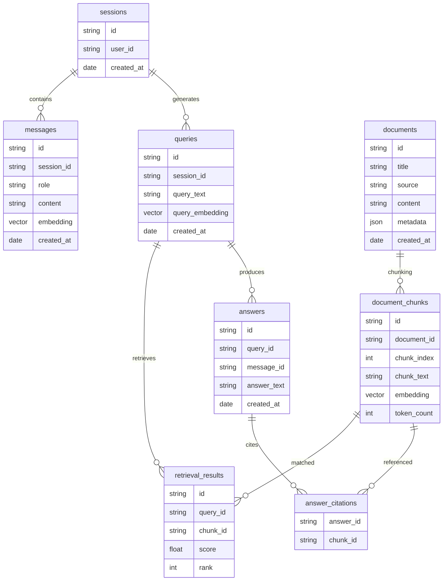

# Agentic RAG System Design

## 1. Overview

This document describes the architecture and data model for an **Agentic Retrieval-Augmented Generation (RAG) system** designed to:

- manage multi-turn user sessions
- retrieve relevant document chunks
- generate grounded answers using an LLM
- track retrieval results and citations
- maintain full query and answer traceability

The system combines:

- **Session-aware conversational context**
- **Query planning using a reasoning agent**
- **Hybrid document retrieval**
- **LLM-based answer generation**
- **Grounding validation**
- **Structured persistence for observability and traceability**

---

# 2. High Level Architecture

The system processes a user query through several stages:

1. Prompt ingestion
2. Session context construction
3. Query rewriting
4. Task planning via reasoning agent
5. Retrieval pipeline
6. Context compaction
7. LLM answer generation
8. Grounding validation
9. Response delivery

Key architectural components:

| Component | Responsibility |
|-----------|---------------|
| Application | Entry point and orchestration layer |
| Session Context Builder | Builds conversation history |
| Query Rewriter | Optimizes queries for retrieval |
| Reasoning Agent | Determines retrieval strategy |
| Retrieval Agent | Executes search pipeline |
| Chunk Selector | Reduces context size |
| LLM | Generates responses |
| Grounding Check | Validates citation support |

---

# 3. System Sequence Diagrams

## 3.1 Query Processing and Planning

```mermaid
sequenceDiagram
    participant User
    participant Application
    participant SessionContextBuilder
    participant QueryRewriter
    participant ReasoningAgent

    User->>Application: User Prompt

    Application->>SessionContextBuilder: Build session context
    SessionContextBuilder-->>Application: Context

    Application->>QueryRewriter: Rewrite query
    QueryRewriter-->>Application: Optimized query

    Application->>ReasoningAgent: Plan retrieval
    ReasoningAgent-->>Application: Retrieval plan
````

### Description

This stage prepares the query before retrieval.

Steps:

1. User sends prompt
2. Session context is retrieved
3. Query is rewritten for semantic retrieval
4. Reasoning agent determines retrieval strategy

**Output:** Structured retrieval query

---

## 3.2 Retrieval and Generation Pipeline

```mermaid
sequenceDiagram
    participant Application
    participant RetrievalAgent
    participant VectorSearch
    participant HybridSearch
    participant MetadataFilter
    participant Reranker
    participant ChunkSelector
    participant LLM
    participant GroundingCheck
    participant Client

    Application->>RetrievalAgent: Execute retrieval plan

    RetrievalAgent->>VectorSearch: Semantic search
    RetrievalAgent->>HybridSearch: Keyword search
    RetrievalAgent->>MetadataFilter: Filter documents
    MetadataFilter-->>RetrievalAgent: Filtered results

    RetrievalAgent->>Reranker: Rank chunks
    Reranker-->>RetrievalAgent: Ranked results

    RetrievalAgent-->>Application: Retrieved chunks

    Application->>ChunkSelector: Compress context
    ChunkSelector-->>Application: Compact context

    Application->>LLM: Prompt + Context
    LLM-->>Application: Generated response

    Application->>GroundingCheck: Validate answer
    GroundingCheck-->>Application: Verified answer

    Application-->>Client: Final response
```

### Description

This stage performs document retrieval and response generation.

Steps:

1. Retrieval agent performs multiple search strategies
2. Results are filtered and reranked
3. Top chunks are selected
4. LLM generates answer
5. Grounding check validates citation coverage

---

# 4. Database Design

The database supports:

* session tracking
* query logging
* retrieval observability
* answer traceability
* citation grounding

---

# 5. Entity Relationship Diagram



---

# 6. Database Entity Descriptions

## sessions

Represents a user conversation.

| Field      | Description        |
| ---------- | ------------------ |
| id         | session identifier |
| user_id    | associated user    |
| created_at | session start time |

---

## messages

Stores conversation messages.

| Field      | Description           |
| ---------- | --------------------- |
| id         | message identifier    |
| session_id | session reference     |
| role       | user / assistant      |
| content    | message content       |
| embedding  | vector representation |
| created_at | timestamp             |

---

## documents

Stores source knowledge documents.

| Field      | Description         |
| ---------- | ------------------- |
| id         | document identifier |
| title      | document title      |
| source     | document source     |
| content    | full document text  |
| metadata   | structured metadata |
| created_at | ingestion time      |

---

## document_chunks

Documents are split into smaller chunks for retrieval.

| Field       | Description           |
| ----------- | --------------------- |
| id          | chunk identifier      |
| document_id | parent document       |
| chunk_index | chunk position        |
| chunk_text  | chunk content         |
| embedding   | vector representation |
| token_count | token size            |

---

## queries

Represents a query generated from a user prompt.

| Field           | Description                      |
| --------------- | -------------------------------- |
| id              | query identifier                 |
| session_id      | session reference                |
| query_text      | rewritten query                  |
| query_embedding | embedding used for vector search |
| created_at      | timestamp                        |

---

## retrieval_results

Stores which chunks were retrieved.

| Field    | Description       |
| -------- | ----------------- |
| id       | record identifier |
| query_id | associated query  |
| chunk_id | retrieved chunk   |
| score    | similarity score  |
| rank     | reranked position |

---

## answers

Stores generated answers.

| Field       | Description                 |
| ----------- | --------------------------- |
| id          | answer identifier           |
| query_id    | originating query           |
| message_id  | assistant message reference |
| answer_text | generated response          |
| created_at  | timestamp                   |

---

## answer_citations

Maps answers to supporting document chunks.

| Field     | Description      |
| --------- | ---------------- |
| answer_id | answer reference |
| chunk_id  | cited chunk      |

---

# 7. Data Flow Through the System

### Query Flow

```
User Prompt
     ↓
Message Stored
     ↓
Query Created
     ↓
Embedding Generated
     ↓
Retrieval Results Stored
     ↓
Answer Generated
     ↓
Answer Stored
     ↓
Citations Stored
```

---

# 8. Observability and Traceability

The design allows full inspection of:

* which query generated which answer
* which chunks were retrieved
* how chunks were ranked
* which chunks supported the final answer

This enables:

* debugging hallucinations
* improving retrieval
* evaluating RAG performance
* building analytics dashboards

---

# 9. Future Enhancements

## Agent Improvements

* multi-step tool use
* reasoning trace logging
* tool execution history

## Retrieval Improvements

* BM25 + vector hybrid scoring
* query decomposition
* multi-hop retrieval

## Database Improvements

Additional tables:

* `agent_actions`
* `tool_calls`
* `evaluation_metrics`
* `feedback`
