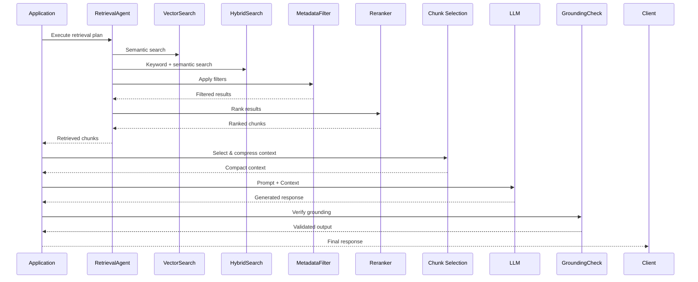

## Retrieval, Generation & Validation Sequence

This diagram focuses on retrieval pipeline and LLM generation.

```mermaid
sequenceDiagram
    participant Application
    participant RetrievalAgent
    participant VectorSearch
    participant HybridSearch
    participant MetadataFilter
    participant Reranker
    participant ChunkSelector as Chunk Selection
    participant LLM
    participant GroundingCheck
    participant Client

    Application->>RetrievalAgent: Execute retrieval plan

    RetrievalAgent->>VectorSearch: Semantic search
    RetrievalAgent->>HybridSearch: Keyword + semantic search
    RetrievalAgent->>MetadataFilter: Apply filters
    MetadataFilter-->>RetrievalAgent: Filtered results

    RetrievalAgent->>Reranker: Rank results
    Reranker-->>RetrievalAgent: Ranked chunks

    RetrievalAgent-->>Application: Retrieved chunks

    Application->>ChunkSelector: Select & compress context
    ChunkSelector-->>Application: Compact context

    Application->>LLM: Prompt + Context
    LLM-->>Application: Generated response

    Application->>GroundingCheck: Verify grounding
    GroundingCheck-->>Application: Validated output

    Application-->>Client: Final response
```