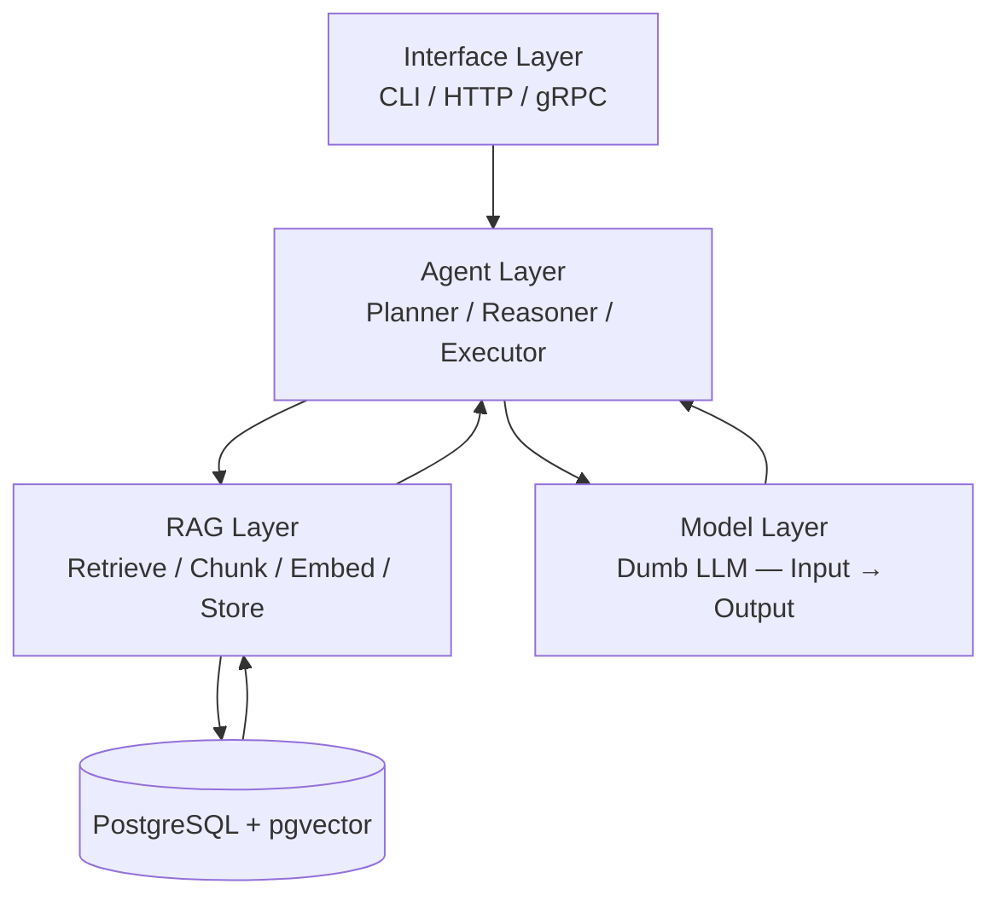
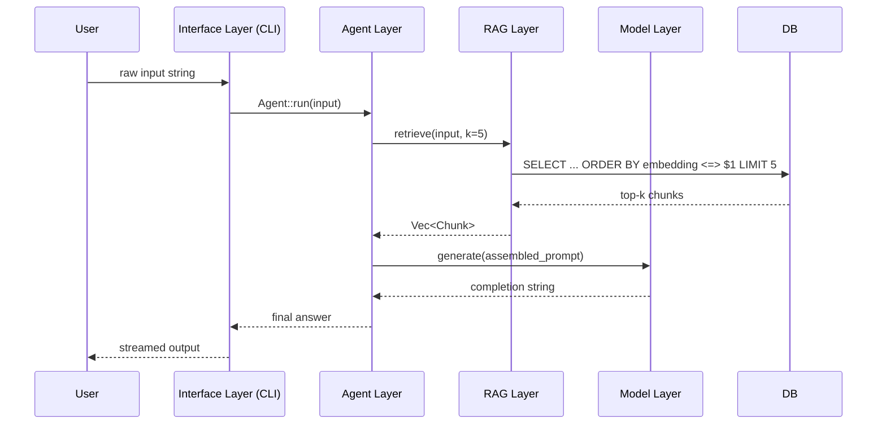

# Phase 0 — Initial Agent Architecture Proposal

> **Status:** Proposed  
> **Replaces:** Current flat CLI→LLM loop (`cli.rs` + `agent/model.rs`)  
> **Goal:** Establish the foundational 5-layer architecture all future phases will build on.

---

## 1. Motivation

The current implementation is a thin wrapper: user input is formatted into a prompt and fed directly to an LLM session. There is no agent logic, no retrieval, and no persistent memory. Before adding features (session management, query planning, grounding, hybrid search), the codebase needs a clean, layered foundation where each concern lives in exactly one place.

Phase 0 defines that foundation.

---

## 2. Target Architecture



The system is structured as **five distinct layers**. Data only flows between adjacent or explicitly-connected layers. No layer skips another.

---

## 3. Layer Definitions

### 3.1 Interface Layer — `UI`

**Responsibility:** Accept user requests, stream responses, enforce transport-level concerns.

| Aspect | Phase 0 scope |
|--------|--------------|
| Transport | CLI only (stdin/stdout) |
| Input | Raw text string from the user |
| Output | Streamed text back to the user |
| Protocol | None — direct function call to Agent Layer |

The Interface Layer **does not** build prompts, decide what to retrieve, or call the LLM directly. It delegates everything to the Agent Layer.

**Future:** HTTP (REST/SSE) and gRPC transports are drop-in additions at this layer only—no other layer changes.

---

### 3.2 Agent Layer — `AG`

**Responsibility:** Orchestrate the full request lifecycle. This is the only layer that coordinates between RAG and the Model Layer.

Sub-components introduced in Phase 0 (stubs acceptable at this stage):

| Sub-component | Role |
|---------------|------|
| **Planner** | Decides whether retrieval is needed and what query to issue |
| **Reasoner** | Assembles context from retrieval results + LLM output |
| **Executor** | Drives the turn: calls RAG, calls LLM, returns final answer |

**Phase 0 minimum:** A single `Agent::run(input: &str) -> Result<String>` that wires the three sub-components in sequence. Internal structure can be a single function initially; the split into Planner/Reasoner/Executor is the refactor target for Phase 1.

**Invariant:** The Agent Layer is the **only caller** of both the RAG Layer and the Model Layer.

---

### 3.3 RAG Layer — `RAG`

**Responsibility:** All document-related operations: ingestion, chunking, embedding, and semantic retrieval.

Operations in Phase 0 scope:

| Operation | Description |
|-----------|-------------|
| `store(text)` | Chunk text, embed each chunk, persist to DB |
| `retrieve(query, k)` | Embed query, run cosine similarity search, return top-k chunks |

Chunking strategy: fixed-size token windows with overlap (parameters TBD in implementation).  
Embedding model: `bge-small` (consistent with existing DB schema).  
Similarity metric: cosine distance (`<=>` pgvector operator).

The RAG Layer **only reads/writes the DB**. It does not call the LLM.

---

### 3.4 Model Layer — `LLM`

**Responsibility:** Stateless text generation. Takes a fully-formed prompt string, returns a completion string.

```
Input:  String (complete prompt, already assembled by Agent Layer)
Output: String (generated completion)
```

This layer is intentionally "dumb" — it has no knowledge of sessions, retrieval, or tool use. Prompt construction is entirely the Agent Layer's responsibility.

**Phase 0 scope:** Wrap existing `ModelWrapper` + `SessionWrapper` behind a single `generate(prompt: &str) -> Result<String>` function. The session is owned by the Agent Layer or the Model Layer wrapper — not the Interface Layer.

---

### 3.5 Database — `DB`

**Responsibility:** Persistent storage for document chunks and their vector embeddings, plus memory (future).

Phase 0 schema (already partially defined):

| Table | Purpose |
|-------|---------|
| `document_chunks` | Chunked text + `bge-small` embeddings |
| `memory` | Agent working memory (stubbed in Phase 0) |

Connection pool (`PgPool`) is initialized once at startup and injected into the RAG Layer. No other layer touches the DB directly.

---

## 4. Current State vs. Phase 0 Target

| Concern | Current (`master`) | Phase 0 target |
|---------|-------------------|----------------|
| Entry point | `main.rs` → `cli::run()` | `main.rs` → Interface Layer → Agent Layer |
| Prompt building | `cli.rs::build_prompt()` | Agent Layer (Executor/Reasoner) |
| LLM call | `cli.rs` (inline) | Model Layer (`generate()`) |
| Retrieval | None | RAG Layer (`retrieve()`) |
| Document ingestion | None | RAG Layer (`store()`) |
| DB access | `db/connection.rs` (unused in loop) | RAG Layer only, via connection pool |
| Session/state | Stateful `SessionWrapper` in CLI | Owned by Agent Layer |

---

## 5. Module Structure (Phase 0)

```
lala/src/
  main.rs                 # Startup: init DB pool, load model, hand off to Interface Layer
  interface/
    mod.rs
    cli.rs                # Readline loop → calls agent::run()
  agent/
    mod.rs                # Agent::run() — orchestrates Planner, Reasoner, Executor
    planner.rs            # Decides retrieval need and query shape (stub: always retrieve)
    reasoner.rs           # Assembles final prompt from context + history (stub: naive concat)
    executor.rs           # Drives the turn end-to-end
  rag/
    mod.rs
    retriever.rs          # retrieve(query, k) → Vec<Chunk>
    store.rs              # store(text) → chunk + embed + persist
    embedder.rs           # embed(text) → Vec<f32>  (bge-small)
    chunker.rs            # chunk(text) → Vec<String>
  model/
    mod.rs
    wrapper.rs            # ModelWrapper + generate(prompt) -> String  (moved from agent/)
  db/
    mod.rs
    connection.rs         # PgPool init (unchanged)
    schema.rs             # Type definitions for DB rows
```

---

## 6. Data Flow — Phase 0 Request Lifecycle



---

## 7. What Phase 0 Explicitly Defers

The following features are **out of scope** for Phase 0. They will be addressed in later phases once the layer boundaries are stable.

| Feature | Target phase |
|---------|-------------|
| Query rewriting | Phase 1 |
| Multi-step planning (tool calls) | Phase 1 |
| Session / conversation history | Phase 1 |
| Reranking retrieved chunks | Phase 2 |
| Hybrid (keyword + vector) search | Phase 2 |
| Grounding / citation validation | Phase 2 |
| HTTP / gRPC interface | Phase 3 |
| Streaming from Model Layer | Phase 1 |
| Metadata filtering | Phase 2 |

---

## 8. Acceptance Criteria for Phase 0

Phase 0 is complete when:

- [ ] A user can type a question in the CLI and receive a response grounded in retrieved document chunks.
- [ ] The five layers are implemented as separate Rust modules with no cross-layer imports that violate the dependency rules in §2.
- [ ] `Agent::run()` is the single entry point from the Interface Layer.
- [ ] The RAG Layer can store at least one document (via a `/ingest` CLI command or startup fixture) and retrieve relevant chunks for a query.
- [ ] The Model Layer exposes only `generate(prompt: &str) -> Result<String>` to other layers.
- [ ] The DB connection pool is initialized once and injected — not re-opened per request.
- [ ] All existing `cargo build` and `cargo check` passes with zero warnings.

---

## 9. Relation to Existing Design Documents

| Document | Role after Phase 0 |
|----------|--------------------|
| `doc/design.md` | Full system vision — remains the long-term north star |
| `doc/queries.md` | Query planning sequences — input to Phase 1 agent design |
| `doc/retrival.md` | Retrieval pipeline sequences — input to Phase 2 RAG design |
| `doc/phase0-proposal.md` | **This document** — Phase 0 implementation contract |

The existing design documents describe the complete target state. Phase 0 is the architectural scaffolding that makes incremental delivery toward that target possible without large-bang rewrites.
