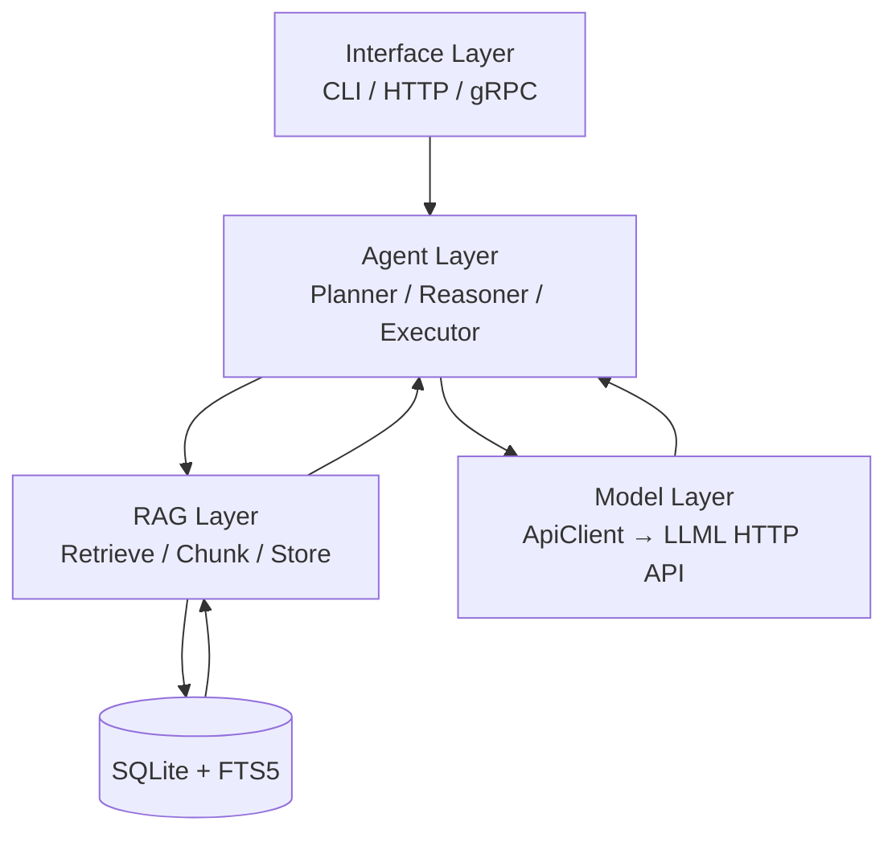
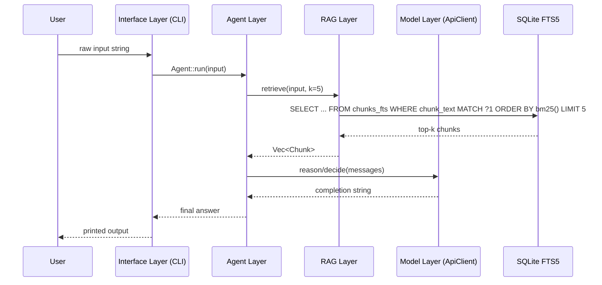

# Phase 0 — Initial Agent Architecture

> **Status:** In Progress  
> **Branch:** `master`  
> **Replaces:** Flat CLI→LLM loop (`cli.rs` + `agent/model.rs`)  
> **Goal:** Establish the foundational 5-layer architecture all future phases will build on.

---

## 1. Motivation

The current implementation is a thin wrapper: user input is formatted into a prompt and fed directly to an LLM session. There is no agent logic, no retrieval, and no persistent memory. Before adding features (session management, query planning, grounding, hybrid search), the codebase needs a clean, layered foundation where each concern lives in exactly one place.

Phase 0 defines that foundation.

---

## 2. Target Architecture



The system is structured as **five distinct layers**. Data only flows between adjacent or explicitly-connected layers. No layer skips another.

---

## 3. Layer Definitions

### 3.1 Interface Layer — `UI`

**Responsibility:** Accept user requests, stream responses, enforce transport-level concerns.

| Aspect | Phase 0 scope |
|--------|--------------|
| Transport | CLI only (stdin/stdout) |
| Input | Raw text string from the user |
| Output | Streamed text back to the user |
| Protocol | None — direct function call to Agent Layer |

The Interface Layer **does not** build prompts, decide what to retrieve, or call the LLM directly. It delegates everything to the Agent Layer.

**Future:** HTTP (REST/SSE) and gRPC transports are drop-in additions at this layer only—no other layer changes.

---

### 3.2 Agent Layer — `AG`

**Responsibility:** Orchestrate the full request lifecycle. This is the only layer that coordinates between RAG and the Model Layer.

Sub-components introduced in Phase 0 (stubs acceptable at this stage):

| Sub-component | Role |
|---------------|------|
| **Planner** | Decides whether retrieval is needed and what query to issue |
| **Reasoner** | Assembles context from retrieval results + LLM output |
| **Executor** | Drives the turn: calls RAG, calls LLM, returns final answer |

**Phase 0 minimum:** A single `Agent::run(input: &str) -> Result<String>` that wires the three sub-components in sequence. Internal structure can be a single function initially; the split into Planner/Reasoner/Executor is the refactor target for Phase 1.

**Invariant:** The Agent Layer is the **only caller** of both the RAG Layer and the Model Layer.

---

### 3.3 RAG Layer — `RAG`

**Responsibility:** All document-related operations: ingestion, chunking, and keyword retrieval.

Operations in Phase 0 scope:

| Operation | Description |
|-----------|-------------|
| `store(title, source, text)` | Chunk text, persist to SQLite FTS5 |
| `retrieve(query, k)` | Full-text search via FTS5 BM25 ranking, return top-k chunks |

Chunking strategy: fixed-size **character** windows (512 chars, 64-char overlap).  
Retrieval engine: SQLite FTS5 with native `bm25()` ranking — no neural embeddings in Phase 0.  
DB crate: `rusqlite` with `bundled` feature (compiles SQLite + FTS5 in).

The RAG Layer **only reads/writes the DB**. It does not call the LLM. It is a self-contained module with no dependencies on other layers — see [phase0-rag.md §12](phase0-rag.md) for the module independence principle.

---

### 3.4 Model Layer — `LLM`

**Responsibility:** Stateless text generation. Takes structured messages, returns a completion string.

```
Input:  Vec<ChatMessage> (messages array sent to LLML over HTTP)
Output: String (generated completion)
```

This layer is intentionally "dumb" — it has no knowledge of sessions, retrieval, or tool use. The Model Layer for `lala` is the existing `ApiClient` in `agent/model.rs`, which sends HTTP requests to the LLML Python inference server.

**Phase 0 scope:** No new code needed. The existing `ApiClient` already exposes `chat()`, `reason()`, and `decide()` methods that serve as the Model Layer. Prompt construction happens in the LLML server (`build_prompt()` in `api/routes.py`), not in `lala`.

---

### 3.5 Database — `DB`

**Responsibility:** Persistent storage for document chunks and full-text search indexes.

Phase 0 uses **SQLite + FTS5** (not PostgreSQL/pgvector — that is a future Phase target). The DB is a single file (`./lala.db`) managed entirely by the RAG Layer via `rusqlite`.

Phase 0 schema:

| Object | Type | Purpose |
|--------|------|---------|
| `documents` | Regular table | Parent document metadata (id, title, source, created_at) |
| `chunks_fts` | FTS5 virtual table | Chunked text indexed for BM25 keyword search |

The `rusqlite::Connection` is created once at startup inside `RagStore::open()` and owned by the RAG Layer. No other layer touches the DB directly.

See [phase0-rag.md §2](phase0-rag.md) for the full schema definition.

---

## 4. Current State vs. Phase 0 Target

| Concern | Current (`master`) | Phase 0 target |
|---------|-------------------|-----------------|
| Entry point | `main.rs` → `cli::run(smart_router)` | `main.rs` → Interface Layer → Agent Layer |
| Prompt building | `LLML/api/routes.py build_prompt()` | Stays in LLML — `lala` sends structured messages |
| LLM call | `ApiClient` → HTTP → LLML | Model Layer = existing `ApiClient` ✅ |
| Query routing | `POST /v1/classify` + `LALA_SMART_ROUTER` env ✅ | Done |
| Two-step agent | `run_reasoning()` → `run_decision()` ✅ | Done |
| Direct fast path | `run_direct()` ✅ | Done |
| Retrieval | None | RAG Layer (`retrieve()`) |
| Document ingestion | None | RAG Layer (`store()`) |
| DB access | None | RAG Layer via `rusqlite` (`RagStore`) |
| Session/state | In-memory `Vec<ChatMessage>` in CLI | Owned by Agent Layer |
| Telegram client | Classify → route → spoiler-formatted reply ✅ | Done |

---

## 5. Module Structure (Phase 0)

```
lala/src/
  main.rs                 # Startup: resolve API URL, init RagStore, start CLI
  cli.rs                  # Readline loop, spinner, conversation history, /ingest-file, /search
  agent/
    mod.rs
    model.rs              # ApiClient — HTTP wrapper (chat, reason, decide, classify)
    planner.rs            # Agent — query router, reasoning→decision pipeline
  rag/
    mod.rs                # RagStore, Chunk, store(), retrieve(), unit tests
    chunker.rs            # chunk(text, chunk_size, overlap) → Vec<String>
```

**Notes:**
- No `model/wrapper.rs` — the Model Layer is the existing `ApiClient` in `agent/model.rs`
- No `rag/embedder.rs` — neural embeddings are deferred to Phase 1
- No `db/` directory — SQLite is owned by `RagStore` internally via `rusqlite`
- No `interface/` restructure — `cli.rs` stays at its current location

---

## 6. Data Flow — Phase 0 Request Lifecycle



> **Note:** Phase 0 delivers RAG store + retrieve as isolated CLI commands (`/ingest-file`, `/search`). The agent-to-RAG wiring shown above is the Phase 1 integration target.

---

## 7. What Phase 0 Explicitly Defers

The following features are **out of scope** for Phase 0. They will be addressed in later phases once the layer boundaries are stable.

| Feature | Target phase |
|---------|-------------|
| Query rewriting | Phase 1 |
| Multi-step planning (tool calls) | Phase 1 |
| Session / conversation history | Phase 1 |
| Reranking retrieved chunks | Phase 2 |
| Hybrid (keyword + vector) search | Phase 2 |
| Grounding / citation validation | Phase 2 |
| HTTP / gRPC interface | Phase 3 |
| Streaming from Model Layer | Phase 1 |
| Metadata filtering | Phase 2 |

---

## 8. Acceptance Criteria for Phase 0

Phase 0 is complete when:

- [x] The query router (`POST /v1/classify` + `RouteDecision`) directs simple queries to the decision model directly, skipping the reasoning step.
- [x] `Agent::classify_query()` is the single routing entry point, with a local heuristic fallback.
- [x] Telegram bot integrates the classifier and displays reasoning to users via `<tg-spoiler>`.
- [ ] The RAG Layer (`lala/src/rag/`) can store at least one document and retrieve relevant chunks via `/ingest-file` and `/search` CLI commands.
- [ ] RAG module is self-contained — no imports from agent, cli, or model layers.
- [ ] The Model Layer (existing `ApiClient`) continues to work unchanged for the two-step agent pipeline.
- [ ] SQLite DB file is created at startup and persists between sessions.
- [ ] All existing `cargo build` and `cargo check` pass with zero warnings.
- [ ] `cargo test -p lala` passes all RAG unit tests (see [phase0-rag.md §10](phase0-rag.md)).

---

## 9. Relation to Existing Design Documents

| Document | Role after Phase 0 |
|----------|--------------------|
| `doc/design.md` | Full system vision — remains the long-term north star |
| `doc/queries.md` | Query planning sequences — input to Phase 1 agent design |
| `doc/retrival.md` | Retrieval pipeline sequences — input to Phase 2 RAG design |
| `doc/phase0-proposal.md` | **This document** — Phase 0 implementation contract |

The existing design documents describe the complete target state. Phase 0 is the architectural scaffolding that makes incremental delivery toward that target possible without large-bang rewrites.
